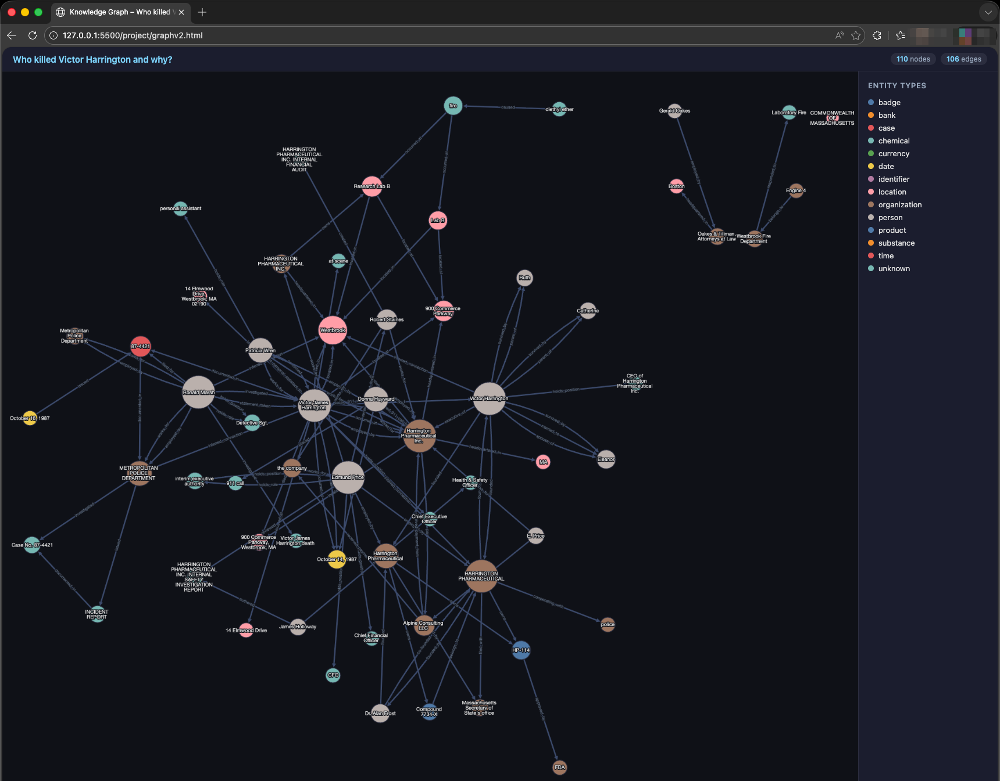

# data_lastchance

**Drop any files. Discover hidden relationships. No API key required for embeddings.**

A local, multimodal, agentic knowledge-graph builder. Point it at a folder of PDFs, MP3s, videos, images, or Office docs and it will ingest everything, learn the domain ontology, run a multi-agent reasoning loop, and produce an interactive knowledge graph — all on your own hardware.



---

## What it does

Most RAG pipelines stop at retrieval. This one keeps going.

1. **Ingests everything** — PDF, plain text, images, audio (Whisper transcription), video, `.docx`/`.xlsx`/`.pptx`. No pre-processing scripts, just drop files into `data/` (sub-folders included).
2. **Learns the ontology** — before any reasoning starts, an `OntologyLearnerAgent` reads the corpus and infers entity types and relation categories specific to *your* domain.
3. **Runs an agent loop** — a `ResearchController` orchestrates four agents in a blackboard pattern until confidence exceeds a threshold:
   - `PlannerAgent` — decomposes the goal into an ordered task list
   - `ResearchAgent` — semantic search → NER → extracts entities and relations
   - `GraphExplorerAgent` — walks the NetworkX graph for multi-hop inferred edges
   - `HypothesisAgent` + `ValidationAgent` — generates and scores relationship hypotheses; exits when `confidence ≥ threshold`
4. **Exports an interactive graph** — every run writes `graph.html` (Cytoscape.js, dark-mode, hover tooltips, colour-coded by entity type).
5. **Interactive query prompt** — after the run you can ask free-form questions about the graph (`neighbors <entity>`, `path <A> <B>`, natural language).

---

## Demo data

The repo ships with two ready-to-run corpora:

**`data/`** — AI research materials (researcher bios, lab histories, project summaries). Sub-folders are scanned automatically.
```
data/
├── andrej_karpathy_bio.txt
├── fei_fei_li_bio.txt
├── ilya_sutskever_bio.txt
├── openai_history.txt
├── stanford_ai_lab.txt
├── tesla_autopilot.txt
└── eureka_labs_nanoGPT.txt
```

**`data_dummy/`** — a fictional murder-mystery document set (great for testing hidden-relationship discovery):
```
data_dummy/
├── 01_police_incident_report.txt
├── 02_witness_statement_chen.txt
├── 03_harrington_letter_to_lawyer.txt
├── 04_financial_audit_q3_1987.txt
├── 05_alpine_consulting_registry.txt
├── 06_medtech_internal_memo.txt
├── 07_lab_accident_report_april87.txt
├── 08_price_phone_records.csv
├── 09_westbrook_chronicle_obituary.txt
├── 10_toxicology_report.txt
├── 11_chen_private_diary.txt
└── 12_alpine_consulting_bank_statement.json
```

To use your own data, drop any supported files into `data/` (or sub-folders — they are scanned recursively).

---

## Quick start

```bash
# Clone and install (requires Python 3.11+, uv)
git clone https://github.com/your-username/data_lastchance
cd data_lastchance
uv sync                  # installs into .venv automatically

# Drop your files into data/ then run (recommended)
uv run python main.py \
  --llm openrouter \
  --model minimax/minimax-m2.5 \
  --api-key sk-or-...
```

Get an OpenRouter API key at [openrouter.ai/keys](https://openrouter.ai/keys) — MiniMax M2.5 is one of the most capable models available there and is very cost-efficient for long-context reasoning over document corpora.

```bash
# Custom research goal
uv run python main.py \
  --llm openrouter \
  --model minimax/minimax-m2.5 \
  --api-key sk-or-... \
  --goal "Find hidden relationships between researchers and institutions." \
  --max-iterations 4

# Load a saved run and query it interactively
uv run python main.py --load graph.json

# Single non-interactive query against a saved run
uv run python main.py --load graph.json --query "neighbors Andrej Karpathy"

# Smoke test with no API key (mock LLM, instant, no network)
uv run python main.py --llm mock
```

Open `graph.html` in any browser after the run to explore the graph interactively.

---

## Architecture

```
CLI (main.py)
    └── ResearchController
            ├── Phase 0 (once)  OntologyLearnerAgent   learns entity types + relation triples
            ├── Phase 1 (once)  PlannerAgent            produces ordered task list
            ├── Phase 2 (loop)  ResearchAgent           retrieval → NER → relationship extraction
            │                   GraphExplorerAgent      multi-hop path discovery; writes inferred edges
            │                   HypothesisAgent         proposes relationship hypotheses every N steps
            │                   ValidationAgent         scores hypotheses; stops loop when confident
            └── Phase 3         graph.html + graph.json + interactive query prompt
```

**Blackboard pattern** — all agents share a single `AgentMemory` instance. No message passing, no queues.

**Confidence-gated termination** — the loop exits when `best_hypothesis.confidence ≥ threshold` (default `0.75`). Pass `--threshold` to tune.

**Fallback everywhere** — FAISS missing? TF-IDF. spaCy missing? Regex NER. Qwen3-VL missing? keyword search. The system always runs.

---

## Embeddings and reranking (fully local, no API key)

The LLM is used only for reasoning. Embeddings always run locally using **Qwen3-VL-Embedding** — images and videos are embedded as pixels, not text, so visual content is semantically searchable.

```bash
# Default: 2B model (~5 GB VRAM, CPU-offloadable)
uv run python main.py --embedding-model Qwen/Qwen3-VL-Embedding-2B

# Higher quality: 8B model (~18 GB VRAM)
uv run python main.py --embedding-model Qwen/Qwen3-VL-Embedding-8B

# Disable reranker for speed
uv run python main.py --no-reranker
```

Weights are downloaded once to `~/.cache/huggingface`.

---

## Supported file types

| Category | Extensions |
|---|---|
| Text | `.txt` `.md` `.rst` `.csv` `.json` `.xml` `.html` |
| PDF | `.pdf` |
| Images | `.jpg` `.jpeg` `.png` `.gif` `.bmp` `.tiff` `.webp` |
| Audio | `.mp3` `.wav` `.ogg` `.flac` `.m4a` |
| Video | `.mp4` `.avi` `.mov` `.mkv` `.webm` |
| Office | `.docx` `.pptx` `.xlsx` |

Audio and video are transcribed locally with **OpenAI Whisper** (no API, runs offline).

```bash
# Choose Whisper model size (tiny → large → turbo)
uv run python main.py --whisper-size turbo
```

---

## LLM backends

| Backend | Flag | Notes |
|---|---|---|
| **OpenRouter** *(recommended)* | `--llm openrouter` | Access to MiniMax M1 and hundreds of other models |
| LM Studio | `--llm lmstudio` | OpenAI-compatible local server |
| Ollama | `--llm ollama` | Local model server |
| Mock | `--llm mock` | Deterministic, no network, good for smoke testing |

```bash
# OpenRouter — recommended
uv run python main.py --llm openrouter --model minimax/minimax-m2.5 --api-key sk-or-...

# Or export the key so you don't have to type it every time
export OPENROUTER_API_KEY=sk-or-...
uv run python main.py --llm openrouter --model minimax/minimax-m2.5

# Local alternatives
uv run python main.py --llm lmstudio --model qwen/qwen3-30b-a3b
uv run python main.py --llm ollama --model llama3
```

---

## Environment variables

| Variable | Purpose |
|---|---|
| `OPENROUTER_API_KEY` | API key for the OpenRouter backend |

No `.env` file needed. Pass the key via `--api-key` or export the variable above.

---

## CLI reference

```
--goal TEXT            Research question for the agent loop
--llm {mock,ollama,openrouter,lmstudio}
--model TEXT           Model name for the chosen LLM backend
--api-key TEXT         API key (or set OPENROUTER_API_KEY)
--base-url TEXT        Override LLM server URL
--embedding-model TEXT Qwen3-VL-Embedding model id or local path
--reranker-model TEXT  Qwen3-VL-Reranker model id or local path
--no-reranker          Disable reranker for faster runs
--whisper-size         Whisper model size: tiny|base|small|medium|large|turbo
--max-iterations INT   Agent loop iteration count (default: 3)
--load PATH            Load a saved report and skip the run
--query TEXT           Single non-interactive query against a loaded report
--ontology-path PATH   Save/load the learned ontology JSON
```

---

## Project layout

```
/                                      ← repo root
├── main.py                            CLI entry point
├── pyproject.toml                     dependencies (uv sync)
├── uv.lock
│
├── agents/
│   ├── base_agent.py                  abstract base class
│   ├── planner_agent.py
│   ├── research_agent.py
│   ├── hypothesis_agent.py
│   ├── validation_agent.py
│   ├── graph_explorer_agent.py
│   └── ontology_learner_agent.py
│
├── controller/
│   └── research_controller.py        orchestrates the full agent loop
│
├── graph/
│   └── knowledge_graph.py            NetworkX DiGraph + GraphML export
│
├── ontology/
│   └── ontology.py                   DomainOntology dataclass
│
├── llm/
│   └── llm.py                        LLM abstraction (Mock/Ollama/OpenRouter/LMStudio)
│
├── tools/
│   └── tools.py                      7 tools + ToolRegistry
│
├── memory/
│   └── memory.py                     AgentMemory blackboard + dataclasses
│
├── ingestion/
│   └── multimodal_ingestion.py
│
└── data/                             ← drop your files here
    ├── andrej_karpathy_bio.txt
    ├── fei_fei_li_bio.txt
    └── ...
```

`graph.html`, `graph.json`, and `ontology.json` are written to the working directory at runtime.

---

## Requirements

- Python 3.11+
- [`uv`](https://github.com/astral-sh/uv) (or `pip install` manually from `pyproject.toml`)
- `ffmpeg` on `PATH` for non-WAV audio (`brew install ffmpeg` / `apt install ffmpeg`)
- GPU optional — everything runs on CPU with automatic offloading

---

## License

MIT
